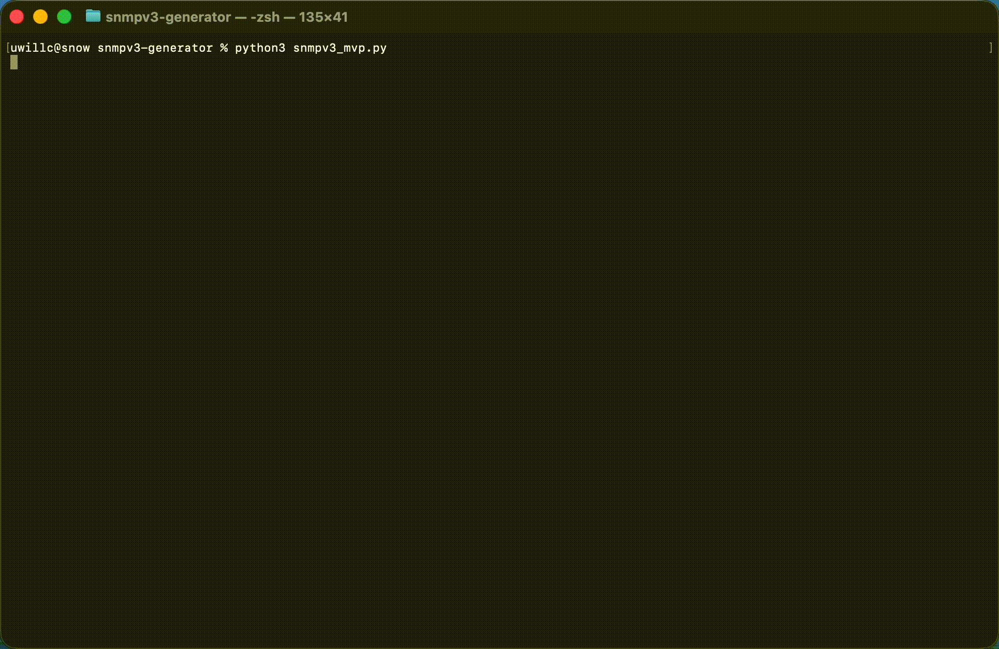

# Cisco Micro-Tool Generator

### **Automated configuration & security tools for Cisco engineers**

Cisco Micro-Tool Generator to zestaw narzędzi, który automatyzuje powtarzalną pracę inżynierów sieciowych.
Generuje konfiguracje, analizuje CVE, proponuje hardening oraz skraca troubleshooting z godzin do minut.

---

## **Misja projektu**

Stworzyć zestaw lekkich micro-narzędzi, które:

* generują konfiguracje Cisco w kilka sekund
* analizują konfiguracje pod kątem bezpieczeństwa
* oceniają podatności i rekomendują aktualizacje
* analizują logi i wskazują możliwe przyczyny problemów

Docelowo: **ekosystem SaaS dla network engineerów.**

---

## **Moduły (roadmap v0.1 → v1.0)**

###v0.1 (MVP – to build now)

* **SNMPv3 Config Generator**
* **NTP Config Generator**
* **AAA/TACACS+ Basic Template**
* **Base Golden Config Template**

###v0.5 (next)

* **Cisco CVE Analyzer**
  Input: device model + OS version → output: list of CVE + mitigation steps

* **Security Hardening Advisor**
  Input: running-config → output: recommended fixes

###v1.0 (SaaS Beta)

* Web UI
* API endpoints
* User profiles
* Configuration history
* Simple subscription model

---

## **Struktura projektu**

```
/cisco-microtool-generator
│
├── snmpv3-generator/
│   └── snmpv3_mvp.py
│
├── ntp-generator/
│   └── ntp_mvp.py
│
├── aaa/
│   └── aaa_basic_template.py
│
├── golden-config/
│   └── base_template.py
│
├── cve-analyzer/
│   └── cve_mvp.py
│
└── README.md
```

---

## **Dlaczego ten projekt powstaje**

Jestem inżynierem sieciowym, który wraca do networkingu po latach SysOps.
Widzę, że:

* inżynierowie tracą 30–60 minut na proste configi,
* nikt nie wie, które CVE dotyczą których urządzeń,
* brakuje automatycznych narzędzi bezpieczeństwa dla Cisco.

> Ten projekt eliminuje te problemy — krok po kroku.

---

## **Wymagania**

* Python 3.10+
* Biblioteki: `requests`, `rich` (opcjonalnie)
* (W przyszłości) Docker + FastAPI

---

## **Status**

Projekt jest w aktywnym rozwoju.
Aktualna faza: **MVP SNMPv3 + NTP + AAA**
Cel: **pierwsze demo SaaS do końca Q1 2026**.

---

## Current modules

### SNMPv3 Config Generator

Generuje kompletną konfigurację SNMPv3 zgodną z najlepszymi praktykami bezpieczeństwa, opartą na danych wejściowych użytkownika.

### NTP Config Generator

Tworzy poprawną i powtarzalną konfigurację NTP, pozwalając szybko zdefiniować serwery czasu i ustawienia bezpieczeństwa.

### AAA/TACACS+ Generator

Buduje szkielet konfiguracji AAA wraz z integracją TACACS+/RADIUS, zapewniając spójny i bezpieczny proces logowania oraz autoryzacji.

### Golden Config Generator

Dostarcza bazowy "golden config" dla nowych urządzeń Cisco, standaryzując początkową konfigurację zgodnie z dobrymi praktykami.

---

## 🚀 SaaS-ready Demo

This project is evolving into a micro-SaaS focused on generating secure, production-ready configurations for Cisco IOS/XE devices.  
The goal: automate repetitive CLI work and deliver consistent, security-aligned configs in seconds.

Below is a short demo of the **SNMPv3 Config Generator** running in secure-default mode.

<details>
  <summary><strong>Click to expand the GIF</strong></summary>



</details>

---

## **Kontakt**

LinkedIn: [https://www.linkedin.com/in/przemyslaw-snow](https://www.linkedin.com/in/przemyslaw-snow)
